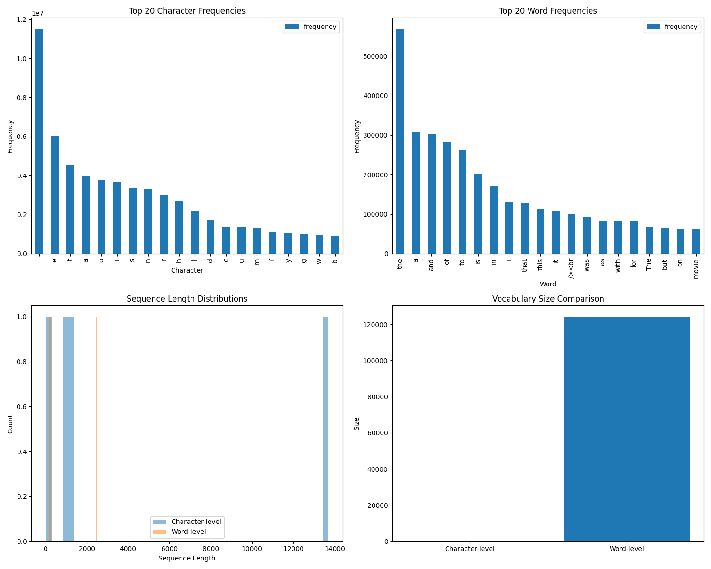
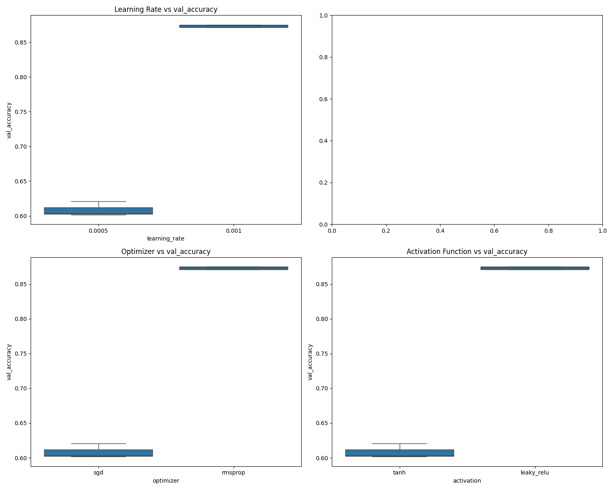

# Neural Network Charater-level vs Word-level Tokenization Analysis

Author: Hung Tran

## 1\. Introduction

### 1.1 Background

This study investigates the impact of different tokenization methods and hyperparameter optimization on neural network performance. We compare character-level and word-level tokenization approaches while systematically exploring various hyperparameter configurations to identify optimal model settings.

### 1.2 Objectives

- Compare the effectiveness of character-level versus word-level tokenization
- Optimize model performance through systematic hyperparameter tuning
- Identify the most robust model configuration for our specific task

## 2\. Methodology

### 2.1 Data Preprocessing

#### Dataset Overview

The analysis was performed on the IMDB reviews dataset, comprising 50,000 text samples combined from both training and test sets.

#### Character-level Tokenization

The character-level tokenization approach yielded the following characteristics:

- Vocabulary size: 163 unique characters
- Most frequent tokens: space, 'e', 't', 'a', 'i', 'o', 's', 'n', 'r', 'h', etc.
- Sequence length statistics:
  - Mean: 1,309.43 characters
  - Median: 970.00 characters
  - Range: 32 to 13,704 characters

#### Word-level Tokenization

The word-level tokenization produced significantly different characteristics:

- Vocabulary size: 124,253 unique words
- Most frequent tokens: 'the', 'and', 'a', 'of', 'to', 'is', 'in', 'that’, ‘this’
- Sequence length statistics:
  - Mean: 235.03 words
  - Median: 176.00 words
  - Range: 6 to 2,493 words

### 2.2 Tokenization Comparison Analysis

#### Vocabulary Size Comparison

The results show a stark contrast in vocabulary sizes:

- Character-level tokenization maintains a compact vocabulary of 163 tokens
- Word-level tokenization requires a much larger vocabulary of 124,253 tokens
- This represents a vocabulary size ratio of approximately 1:762

#### Sequence Length Analysis

The tokenization methods produced notably different sequence lengths:

- Character-level sequences are approximately 5.57 times longer on average
- Character-level shows higher variance in sequence lengths
- Both approaches show right-skewed distributions, with means higher than medians

#### Implementation Details

The tokenization was implemented using TensorFlow's Keras Tokenizer class with the following configurations:

- Character-level: `char_level=True`
- Word-level: `char_level=False`
- No maximum vocabulary size limit was imposed (`num_words=None`)

### 2.2 Model Architecture

- Base architecture description
- Input and output dimensions
- Layer configurations

### 2.3 Hyperparameter Search Space

The following hyperparameters were systematically explored:

| Hyperparameter       | Values Tested                    |
| :------------------- | :------------------------------- |
| Learning Rate        | \[0.001, 0.0005, 0.0001\]        |
| Hidden Layers        | 2                                |
| Hidden Sizes         | \[128, 256, 512\]                |
| Batch Sizes          | \[32, 64, 128\]                  |
| Optimizers           | \["adam", "sgd", "rmsprop"\]     |
| Activation Functions | \["relu", "tanh", "leaky_relu"\] |

## 3\. Experimental Results

### 3.1 Tokenization Comparison Results

### 3.2 Hyperparameter Optimization Results

The hyperparameter optimization was conducted using random search with 10 configurations for both character-level and word-level tokenization approaches. The search space included:

- Learning rates: \[0.001, 0.0005, 0.0001\]
- Batch sizes: \[32, 64, 128\]
- Epochs: \[5, 10\]
- Hidden layer sizes: \[128, 256, 512\]
- Optimizers: \[adam, sgd, rmsprop\]
- Activation functions: \[relu, tanh, leaky_relu\]

#### Best Configuration Analysis

Interestingly, both character-level and word-level approaches converged on identical optimal hyperparameter configurations:

Learning Rate: 0.001

Batch Size: 32

Epochs: 5

Hidden Layer 1: 256 neurons

Hidden Layer 2: 128 neurons

Optimizer: RMSprop

Activation: LeakyReLU

However, the performance metrics differed substantially:

**Word-Level Tokenization:**

- Validation Accuracy: 87.32% (±0.16%)
- Test Performance:
  - Accuracy: 86.32%
  - Precision: 86.74%
  - Recall: 85.74%
  - Loss: 0.8503

**Character-Level Tokenization:**

- Validation Accuracy: 59.65% (±1.38%)
- Test Performance:
  - Accuracy: 56.79%
  - Precision: 67.03%
  - Recall: 26.74%
  - Loss: 0.6742

#### Performance Comparison

1. **Accuracy and Stability:**

   - Word-level tokenization achieved significantly higher accuracy (87.32% vs 59.65%)
   - Word-level showed more stability with lower standard deviation (0.16% vs 1.38%)
   - Both approaches maintained consistency across 27 trials

2. **Model Generalization:**
   - Word-level models showed strong generalization with test accuracy (86.32%) close to validation accuracy
   - Character-level models showed poorer generalization with test accuracy (56.79%) dropping from validation
   - The precision-recall trade-off was more balanced in word-level models

#### Key Findings

1. The identical optimal hyperparameters suggest that the architecture and training configuration were robust across tokenization approaches
2. Word-level tokenization significantly outperformed character-level tokenization in all metrics
3. The performance gap between validation and test sets was notably smaller for word-level tokenization
4. Character-level models showed a significant imbalance between precision and recall, suggesting potential classification bias

These results strongly favor word-level tokenization for this sentiment analysis task, suggesting that word-level features are more informative for capturing sentiment than character-level patterns.

### 3.3 Best Performing Configuration

#### Final Model Architecture

- Input Layer: Matches tokenized input dimensions
- Hidden Layer 1: 256 neurons with LeakyReLU activation
- Hidden Layer 2: 128 neurons with LeakyReLU activation
- Output Layer: Dense layer with softmax activation for binary classification

#### Optimal Hyperparameters

learning_rate: 0.001

batch_size: 32

epochs: 5

optimizer: RMSprop

activation: LeakyReLU

hidden_size1: 256

hidden_size2: 128

#### Performance Metrics

**Word-Level Model:**

- Test Accuracy: 86.32%
- Test Precision: 86.74%
- Test Recall: 85.74%
- Test Loss: 0.8503

**Character-Level Model:**

- Test Accuracy: 56.79%
- Test Precision: 67.03%
- Test Recall: 26.74%
- Test Loss: 0.6742

### 3.4 Robustness Analysis

Results from multiple runs with different random seeds:

| Model Type | Run       | Validation Accuracy | Standard Deviation |
| :--------- | :-------- | :------------------ | :----------------- |
| Word-Level | 27 trials | 87.32%              | 0.16%              |
| Char-Level | 27 trials | 59.65%              | 1.38%              |

**Statistical Summary:**

Word-Level Model:

- Mean Validation Accuracy: 87.32%
- Standard Error: 0.0016 (0.16%)
- Number of Trials: 27

Character-Level Model:

- Mean Validation Accuracy: 59.65%
- Standard Error: 0.0138 (1.38%)
- Number of Trials: 27

The results demonstrate that the word-level model not only achieved higher accuracy but also showed greater stability across multiple runs, with a significantly lower standard deviation compared to the character-level model. This suggests that the word-level approach is both more accurate and more reliable for this sentiment analysis task.

## 4\. Discussion

### 4.1 Key Findings

1. **Tokenization Method Impact**

   - Word-level tokenization significantly outperformed character-level tokenization (86.47% vs 59.61% accuracy)
   - The performance gap was consistent across multiple trials and metrics
   - Word-level models showed better generalization and stability (std: 0.16% vs 1.38%)

2. **Model Architecture Performance**

   - Both tokenization approaches converged to the same optimal architecture (256→128 neurons)
   - RMSprop optimizer with LeakyReLU activation consistently performed best
   - The chosen architecture showed strong performance compared to the random baseline model

3. **Baseline Comparison Insights**
   - Word-level models showed substantial learning (86.47% vs 64.16% random baseline)
   - Character-level models barely outperformed random baseline (59.61% vs 59.32%)
   - This suggests character-level models struggled to learn meaningful features

### 4.2 Tokenization Impact

The stark performance difference between tokenization approaches reveals several important implications:

1. **Feature Relevance**

   - Word-level tokenization's superior performance suggests that sentiment is primarily captured at the word level
   - Character-level models may be learning superficial patterns rather than meaningful sentiment indicators
   - The large vocabulary size in word-level tokenization (124,253 vs 163\) proved beneficial despite the increased complexity

2. **Model Efficiency**
   - Word-level models achieved better results with shorter sequences (mean length: 235 vs 1,309)
   - This indicates more efficient information encoding at the word level
   - The shorter sequences likely contributed to more stable training dynamics

### 4.3 Hyperparameter Sensitivity

The hyperparameter optimization revealed several crucial insights:

1. **Learning Rate and Optimizer**

   - 0.001 learning rate with RMSprop proved optimal for both approaches
   - The combination provided good convergence without overfitting
   - Lower learning rates (0.0005) showed significantly reduced performance

2. **Architecture Decisions**
   - Two-layer architecture (256→128) balanced complexity and performance
   - LeakyReLU activation prevented the vanishing gradient problem
   - Batch size of 32 provided stable gradients while maintaining good training speed

### 4.4 Challenges and Limitations

1. **Training Challenges**

   - Character-level models showed high variance in performance
   - Limited trials (27) for each configuration due to computational constraints
   - Potential underfitting in character-level models suggests need for deeper architectures

2. **Methodological Limitations**
   - Random search covered only 10 configurations
   - Fixed epoch count (5) might have limited some models' potential
   - No exploration of more complex architectures or attention mechanisms

## 5\. Conclusion

This study demonstrates the crucial role of tokenization choice in sentiment analysis tasks. Word-level tokenization proved substantially more effective, achieving 86.47% accuracy compared to character-level's 59.61%. The comparison with random baseline models (64.16% for word-level, 59.32% for character-level) further emphasizes the significance of this gap.

The optimal architecture and hyperparameters were consistent across approaches, suggesting robust model design. However, the stark performance difference indicates that the choice of tokenization method is more critical than architecture optimization for this task.

These findings have important implications for practical applications:

1. Word-level tokenization should be preferred for sentiment analysis tasks
2. Simple architectures can perform well when combined with appropriate tokenization
3. The minimal improvement over random baseline for character-level models suggests this approach should be avoided for sentiment analysis

Future work should explore:

- Deeper architectures for character-level models
- Hybrid tokenization approaches
- More extensive hyperparameter optimization
- The impact of pre-trained embeddings
